   

## Contents

- **[Attack AI](#attack-ai)** `79`
  - [LLM Red Teaming & Scanners](#llm-red-teaming--scanners) `37`
  - [Agent & MCP Security Testing](#agent--mcp-security-testing) `18`
  - [Adversarial ML](#adversarial-ml) `6`
  - [Jailbreak & Injection Payloads](#jailbreak--injection-payloads) `14`
  - [AI Asset Discovery](#ai-asset-discovery) `4`
- **[Defend AI](#defend-ai)** `45`
  - [Guardrails & AI Firewalls](#guardrails--ai-firewalls) `24`
  - [Agent & MCP Runtime Security](#agent--mcp-runtime-security) `15`
  - [Model & Supply-Chain Security](#model--supply-chain-security) `6`
- **[Hack with AI](#hack-with-ai)** `176`
  - [AI Pentest Agents](#ai-pentest-agents) `63`
  - [AI Code Auditing](#ai-code-auditing) `42`
  - [AI Reverse Engineering](#ai-reverse-engineering) `21`
  - [Security Skills for Coding Agents](#security-skills-for-coding-agents) `50`
- **[Practice & Measure](#practice--measure)** `62`
  - [Vulnerable AI Labs](#vulnerable-ai-labs) `16`
  - [Benchmarks & Datasets](#benchmarks--datasets) `46`

## Attack AI

### LLM Red Teaming & Scanners

> Probe LLMs and LLM apps for jailbreaks, prompt injection, data leakage and unsafe output.  
> **37 tools** · OWASP: stage *Test & Evaluate* · landscape *Red Teaming* · risks LLM01, LLM02, LLM05, LLM07, LLM10

| Project | Description | Stars | Last commit |
| --- | --- | --- | --- |
| [**Promptfoo**](https://github.com/promptfoo/promptfoo) | Test your prompts, agents, and RAGs. Red teaming/pentesting/vulnerability scanning for AI. Compare… |  |  |
| [**garak**](https://github.com/NVIDIA/garak) | the LLM vulnerability scanner |  |  |
| [**AI-Infra-Guard**](https://github.com/Tencent/AI-Infra-Guard) | A full-stack AI Red Teaming platform securing AI ecosystems via Agent Scan, Skills Scan, MCP scan… |  |  |
| [**Giskard**](https://github.com/Giskard-AI/giskard-oss) | 🐢 Open-Source Evaluation & Testing library for LLM Agents |  |  |
| [**PyRIT**](https://github.com/microsoft/PyRIT) | The Python Risk Identification Tool for generative AI (PyRIT) is an open source framework built to… |  |  |
| [**Purple Llama**](https://github.com/meta-llama/PurpleLlama) | Set of tools to assess and improve LLM security. |  |  |
| [**DeepTeam**](https://github.com/confident-ai/deepteam) | DeepTeam is a framework to red team LLMs and AI agents. |  |  |
| [**Agentic Security**](https://github.com/msoedov/agentic_security) | Agentic LLM Vulnerability Scanner / AI red teaming kit 🧪 |  |  |
| [**FuzzyAI**](https://github.com/cyberark/FuzzyAI) | A powerful tool for automated LLM fuzzing. It is designed to help developers and security… |  |  |
| [**promptmap2**](https://github.com/utkusen/promptmap) | a security scanner for custom LLM applications |  |  |
| [**counterfit**](https://github.com/Azure/counterfit) | a CLI that provides a generic automation layer for assessing the security of ML models |  |  |
| [**EasyJailbreak**](https://github.com/EasyJailbreak/EasyJailbreak) | An easy-to-use Python framework to generate adversarial jailbreak prompts. |  |  |
| [**AI Scanner**](https://github.com/0din-ai/ai-scanner) | AI model safety scanner built on NVIDIA garak |  |  |
| [**deep-pwning**](https://github.com/cchio/deep-pwning) | Metasploit for machine learning. |  |  |
| [**PromptInject**](https://github.com/agencyenterprise/PromptInject) | PromptInject is a framework that assembles prompts in a modular fashion to provide a quantitative… |  |  |
| [**hackagent**](https://github.com/AISecurityLab/hackagent) | HackAgent is an open-source security toolkit to detect vulnerabilities of your AI Agents |  |  |
| [**LLMFuzzer**](https://github.com/mnns/LLMFuzzer) | 🧠 LLMFuzzer - Fuzzing Framework for Large Language Models 🧠 LLMFuzzer is the first open-source… |  |  |
| [**cryptex-oss**](https://github.com/m4xx101/cryptex-oss) | Open-source LLM red-teaming technique toolkit (162 transforms, 36 mutators, 25 tool surfaces). MIT. |  |  |
| [**augustus**](https://github.com/praetorian-inc/augustus) | LLM security testing framework for detecting prompt injection, jailbreaks, and adversarial attacks… |  |  |
| [**HouYi**](https://github.com/LLMSecurity/HouYi) | The automated prompt injection framework for LLM-integrated applications. |  |  |
| [**spikee**](https://github.com/ReversecLabs/spikee) | Simple Prompt Injection Kit for Evaluation and Exploitation |  |  |
| [**LLAMATOR**](https://github.com/LLAMATOR-Core/llamator) | Red Teaming python-framework for testing chatbots and GenAI systems. |  |  |
| [**Whistleblower**](https://github.com/Repello-AI/whistleblower) | Whistleblower is a offensive security tool for testing against system prompt leakage and capability… |  |  |
| [**artkit**](https://github.com/BCG-X-Official/artkit) | Automated prompt-based testing and evaluation of Gen AI applications |  |  |
| [**humanbound**](https://github.com/humanbound/humanbound) | Open-source adversarial testing engine, SDK, and CLI for AI agents. Runs locally or against the… |  |  |
| [**Jailbreaker-CE**](https://github.com/SpecterOps/Jailbreaker-CE) | Jailbreaker is a local evaluation tool for testing chatbot and agent-style systems against… |  |  |
| [**hackmyagent**](https://github.com/opena2a-org/hackmyagent) | Metasploit for AI agents: scan, attack, and fix AI agents and MCP servers. Open source security… |  |  |
| [**kereva-scanner**](https://github.com/kereva-dev/kereva-scanner) | Code scanner to check for issues in prompts and LLM calls |  |  |
| [**nuguard**](https://github.com/NuGuardAI/nuguard) | AI red-teaming tool and LLM security framework to evaluate agentic AI applications. Tests prompt… |  |  |
| [**agentfence**](https://github.com/haggaishachar/agentfence) | AgentFence is an open-source platform for automatically testing AI agent security. It identifies… |  |  |
| [**EvoSynth**](https://github.com/dongdongunique/EvoSynth) | EvoSynth is a SOTA automated LLM red-teaming framework that evolves executable, code-level… |  |  |
| [**LLMInjector**](https://github.com/anmolksachan/LLMInjector) | Burp Suite Extension for LLM Prompt Injection Testing |  |  |
| [**RAGdrag**](https://github.com/itsbroken-ai/RAGdrag) | RAG pipeline security testing toolkit - 27 techniques across 6 kill chain phases, mapped to MITRE… |  |  |
| [**PIForge**](https://github.com/albert-y1n/PIForge) | PIForge: An Open Framework for RL-based Prompt Injection Red Teaming. |  |  |
| [**LangBiTe**](https://github.com/SOM-Research/LangBiTe) | A Bias Tester framework for LLMs |  |  |
| [**CEREBRO-RED v2**](https://github.com/Leviticus-Triage/cerebro-red-v2) | CEREBRO-RED v2: Advanced LLM Red Team Research Platform with PAIR Algorithm and LLM-as-a-Judge… |  |  |
| [**injectlab**](https://github.com/ahow2004/injectlab) | An open-source ATT&CK-style framework and test suite for adversarial LLM security research |  |  |

<a href="#top">↑ back to top</a>

### Agent & MCP Security Testing

> Scan, audit and pentest AI agents, MCP / A2A servers, agent skills and agent configs.  
> **18 tools** · OWASP: stage *Test & Evaluate* · landscape *Agentic* · risks ASI01, ASI02, ASI03, ASI04, ASI05

| Project | Description | Stars | Last commit |
| --- | --- | --- | --- |
| [**SkillSpector**](https://github.com/NVIDIA/SkillSpector) | Security scanner for AI agent skills. Detect vulnerabilities, malicious patterns, security risks… |  |  |
| [**Agent Scan (ex mcp-scan)**](https://github.com/snyk/agent-scan) | Security scanner for AI agents, MCP servers and agent skills. |  |  |
| [**Skill Scanner**](https://github.com/cisco-ai-defense/skill-scanner) | Security Scanner for Agent Skills |  |  |
| [**AgentShield**](https://github.com/affaan-m/agentshield) | AI agent security scanner. Detect vulnerabilities in agent configurations, MCP servers, and tool… |  |  |
| [**MCP Scanner**](https://github.com/cisco-ai-defense/mcp-scanner) | Scan MCP servers for potential threats & security findings. |  |  |
| [**Agentic Radar**](https://github.com/splx-ai/agentic-radar) | A security scanner for your LLM agentic workflows |  |  |
| [**agent-opfor**](https://github.com/KeyValueSoftwareSystems/agent-opfor) | Open-source adversary emulation for AI agents and MCP servers. |  |  |
| [**AgentSeal**](https://github.com/getagentseal/agentseal) | Security toolkit for AI agents. Scan your machine for dangerous skills and MCP configs, monitor for… |  |  |
| [**repo-forensics**](https://github.com/alexgreensh/repo-forensics) | Offline security scanner for AI-agent repos, skills, plugins, and MCP servers. |  |  |
| [**MCP Safety Scanner**](https://github.com/johnhalloran321/mcpSafetyScanner) | MCPSafetyScanner - Automated MCP safety auditing and remediation using Agents. More info… |  |  |
| [**A2A Scanner**](https://github.com/cisco-ai-defense/a2a-scanner) | Scan A2A agents for potential threats and security issues |  |  |
| [**aguara**](https://github.com/garagon/aguara) | The open source security engine for AI agent and supply-chain trust. |  |  |
| [**cc-safe**](https://github.com/ykdojo/cc-safe) | Security scanner for Claude Code settings files. Scans for dangerous patterns in your approved… |  |  |
| [**MCP-ASD**](https://github.com/hoodoer/MCP-ASD) | MCP Attack Surface Detector - Burp plugin to make manual testing of MCP servers easier in Burp Suite |  |  |
| [**inkog**](https://github.com/inkog-io/inkog) | Static security scanner for AI agents. Catches prompt injection, runaway loops, missing oversight… |  |  |
| [**MCP Client and Proxy**](https://github.com/appsecco/mcp-client-and-proxy) | A universal MCP client with proxying feature to interact with MCP Servers which support STDIO… |  |  |
| [**MCPwned**](https://github.com/FenriskSecurity/MCPwned) | MCPwned is a companion extension that enables pentesters to effectively test MCP servers. It… |  |  |
| [**skillguard**](https://github.com/LLMSecurity/skillguard) | Agent Skill Security Auditor — Audit agent skills against OWASP Agentic Top 10 & MITRE ATLAS before… |  |  |

<a href="#top">↑ back to top</a>

### Adversarial ML

> Craft adversarial examples and measure model robustness.  
> **6 tools** · OWASP: stage *Test & Evaluate* · landscape *GenAI LLM* · risks LLM04

| Project | Description | Stars | Last commit |
| --- | --- | --- | --- |
| [**cleverhans**](https://github.com/cleverhans-lab/cleverhans) | An adversarial example library for constructing attacks, building defenses, and benchmarking both |  |  |
| [**Adversarial Robustness Toolbox**](https://github.com/Trusted-AI/adversarial-robustness-toolbox) | Adversarial Robustness Toolbox (ART) - Python Library for Machine Learning Security - Evasion… |  |  |
| [**TextAttack**](https://github.com/QData/TextAttack) | TextAttack 🐙 is a Python framework for adversarial attacks, data augmentation, and model training… |  |  |
| [**foolbox**](https://github.com/bethgelab/foolbox) | A Python toolbox to create adversarial examples that fool neural networks in PyTorch, TensorFlow… |  |  |
| [**AdvBox**](https://github.com/advboxes/AdvBox) | Advbox is a toolbox to generate adversarial examples that fool neural networks in… |  |  |
| [**advertorch**](https://github.com/BorealisAI/advertorch) | A Toolbox for Adversarial Robustness Research |  |  |

<a href="#top">↑ back to top</a>

### Jailbreak & Injection Payloads

> Payload collections, attack techniques and proof-of-concept code.  
> **14 tools** · OWASP: stage *Test & Evaluate* · landscape *Red Teaming* · risks LLM01, LLM07

| Project | Description | Stars | Last commit |
| --- | --- | --- | --- |
| [**ChatGPT_DAN**](https://github.com/0xk1h0/ChatGPT_DAN) | ChatGPT DAN, Jailbreaks prompt |  |  |
| [**llm-security (greshake)**](https://github.com/greshake/llm-security) | New ways of breaking app-integrated LLMs |  |  |
| [**AI Exploits**](https://github.com/protectai/ai-exploits) | A collection of real world AI/ML exploits for responsibly disclosed vulnerabilities |  |  |
| [**Arcanum Prompt Injection Taxonomy**](https://github.com/Arcanum-Sec/arc_pi_taxonomy) | The Arcanum Prompt Injection Taxonomy |  |  |
| [**AI red teaming payloads**](https://github.com/joey-melo/payloads) | Payloads for AI Red Teaming and beyond |  |  |
| [**ChatGPT DAN**](https://github.com/alexisvalentino/Chatgpt-DAN) | DAN - The ‘JAILBREAK’ Version of ChatGPT and How to Use it. (update: this was 3 years ago, might… |  |  |
| [**Model Inversion Attack ToolBox**](https://github.com/ffhibnese/Model-Inversion-Attack-ToolBox) | A comprehensive toolbox for model inversion attacks and defenses, which is easy to get started. |  |  |
| [**pallms**](https://github.com/mik0w/pallms) | Payloads for Attacking Large Language Models |  |  |
| [**GenAI Attacks (TTPs)**](https://github.com/mbrg/genai-attacks) | A knowledge source about TTPs used to target GenAI-based systems, copilots and agents |  |  |
| [**Prompt Injection as Role Confusion**](https://github.com/role-confusion/prompt-injection-as-role-confusion) | Prompt Injection as Role Confusion |  |  |
| [**BadDiffusion**](https://github.com/IBM/BadDiffusion) | Official repo to reproduce the paper "How to Backdoor Diffusion Models?" published at CVPR 2023 |  |  |
| [**code-review-prompts**](https://github.com/Sw4mpf0x/code-review-prompts) | A collection of useful prompts and system prompts for security-oriented code reviews |  |  |
| [**WideOpenAI**](https://github.com/grepstrength/WideOpenAI) | Short list of indirect prompt injection attacks for OpenAI-based models. |  |  |
| [**Basic ML Prompt Injections**](https://github.com/Zierax/Basic-ML-prompt-injections) | llm attacks basic payloads |  |  |

<a href="#top">↑ back to top</a>

### AI Asset Discovery

> Find and inventory exposed LLM services, inference servers, MCP endpoints and agents.  
> **4 tools** · OWASP: stage *Scope & Plan, Govern* · landscape *GenAI LLM, Agentic*

| Project | Description | Stars | Last commit |
| --- | --- | --- | --- |
| [**Julius**](https://github.com/praetorian-inc/julius) | Simple LLM service identification - translate IP:Port to Ollama, vLLM, LiteLLM, or 60+ other AI… |  |  |
| [**AI OSINT**](https://github.com/7WaySecurity/ai_osint) | 🤖 Curated AI OSINT resources — Google dorks, Shodan queries, GitHub dorks, and techniques to… |  |  |
| [**Knostic MCP-Scanner**](https://github.com/knostic/MCP-Scanner) | Advanced Shodan-based scanner for discovering, verifying, and enumerating Model Context Protocol… |  |  |
| [**Agent Discover Scanner**](https://github.com/Defend-AI-Tech-Inc/agent-discover-scanner) | The industry-standard Agentic Identity & Inventory Scanner. Automatically inventory autonomous… |  |  |

<a href="#top">↑ back to top</a>

## Defend AI

### Guardrails & AI Firewalls

> Input / output filtering, prompt-injection and jailbreak detection, LLM firewalls and gateways.  
> **24 tools** · OWASP: stage *Deploy, Operate* · landscape *GenAI LLM* · risks LLM01, LLM02, LLM05, LLM07

| Project | Description | Stars | Last commit |
| --- | --- | --- | --- |
| [**Guardrails AI**](https://github.com/guardrails-ai/guardrails) | Adding guardrails to large language models. |  |  |
| [**NeMo Guardrails**](https://github.com/NVIDIA-NeMo/Guardrails) | NeMo Guardrails is an open-source toolkit for easily adding programmable guardrails to LLM-based… |  |  |
| [**Superagent**](https://github.com/superagent-ai/superagent) | Superagent protects your AI applications against prompt injections, data leaks, and harmful… |  |  |
| [**LLM Guard**](https://github.com/protectai/llm-guard) 🗄️ | The Security Toolkit for LLM Interactions |  |  |
| [**Rebuff**](https://github.com/protectai/rebuff) 🗄️ | LLM Prompt Injection Detector |  |  |
| [**LangKit**](https://github.com/whylabs/langkit) | 🔍 LangKit: An open-source toolkit for monitoring Large Language Models (LLMs). 📚 Extracts signals… |  |  |
| [**AgentDoG**](https://github.com/AI45Lab/AgentDoG) | A Diagnostic Guardrail Framework for AI Agent Safety and Security |  |  |
| [**Arcjet**](https://github.com/arcjet/arcjet-js) | Runtime security for AI apps and agents: prompt injection detection, tool-call authorization… |  |  |
| [**Vigil**](https://github.com/deadbits/vigil-llm) | ⚡ Vigil ⚡ Detect prompt injections, jailbreaks, and other potentially risky Large Language Model… |  |  |
| [**Kiji Proxy**](https://github.com/dataiku/kiji-proxy) | Privacy proxy for your OpenAI requests |  |  |
| [**CaMeL**](https://github.com/google-research/camel-prompt-injection) | Code for the paper "Defeating Prompt Injections by Design" |  |  |
| [**Trylon Gateway**](https://github.com/trylonai/gateway) | The Open Source Firewall for LLMs. A self-hosted gateway to secure and control AI applications with… |  |  |
| [**ZenGuard**](https://github.com/ZenGuard-AI/fast-llm-security-guardrails) | The fastest Trust Layer for AI Agents |  |  |
| [**shellward**](https://github.com/jnMetaCode/shellward) | AI 应用合规网关 · 一行命令体检 AI 项目的「数据出境 / 硬编码密钥 /… |  |  |
| [**last_layer**](https://github.com/arekusandr/last_layer) | Ultra-fast, low latency LLM prompt injection/jailbreak detection ⛓️ |  |  |
| [**PIGuard**](https://github.com/leolee99/PIGuard) | [ACL 2025] The official implementation of the paper "PIGuard: Prompt Injection Guardrail via… |  |  |
| [**gpt-oss-safeguard**](https://github.com/openai/gpt-oss-safeguard) |  |  |  |
| [**hai-guardrails**](https://github.com/presidio-oss/hai-guardrails) | A TypeScript library providing a set of guards for LLM (Large Language Model) applications |  |  |
| [**Armorer Guard**](https://github.com/ArmorerLabs/Armorer-Guard) | Public SDKs and integration contracts for Armorer Guard. |  |  |
| [**Secretless AI**](https://github.com/opena2a-org/secretless-ai) | One command to keep secrets out of AI (LLMs). Works with Claude Code, Cursor, Copilot, Windsurf… |  |  |
| [**Sentinel AI**](https://github.com/MaxwellCalkin/sentinel-ai) | Real-time AI safety guardrails for LLM apps. 10 scanners: prompt injection, PII, harmful content… |  |  |
| [**prompt-shield**](https://github.com/mthamil107/prompt-shield) | Prompt-injection firewall for LLM applications — 33 input detectors, 9 output scanners, federated… |  |  |
| [**piighost**](https://github.com/Athroniaeth/piighost) | Reversible PII masking for LLM agents: piighost replaces personal data with placeholders before the… |  |  |
| [**TrustGate**](https://github.com/NeuralTrust/TrustGate) | Open-source AI gateway for LLM and agent traffic — multi-provider routing, guardrails, semantic… |  |  |

<a href="#top">↑ back to top</a>

### Agent & MCP Runtime Security

> Runtime control for agents: MCP gateways and firewalls, sandboxes, agent identity, detection rules.  
> **15 tools** · OWASP: stage *Deploy, Operate, Monitor* · landscape *Agentic* · risks ASI02, ASI03, ASI05, ASI06, ASI10

| Project | Description | Stars | Last commit |
| --- | --- | --- | --- |
| [**NemoClaw**](https://github.com/NVIDIA/NemoClaw) | Run agents like Hermes, LangChain Deep Agents, and OpenClaw more securely inside NVIDIA OpenShell… |  |  |
| [**OpenShell**](https://github.com/NVIDIA/OpenShell) | OpenShell is the safe, private runtime for autonomous AI agents. |  |  |
| [**Claude Code Devcontainer**](https://github.com/trailofbits/claude-code-devcontainer) | Sandboxed devcontainer for running Claude Code in bypass mode safely. Built for security audits and… |  |  |
| [**Pipelock**](https://github.com/luckyPipewrench/pipelock) | Open-source AI agent firewall for MCP security and agent egress. Scans mediated HTTP, MCP, A2A, and… |  |  |
| [**ironcurtain**](https://github.com/provos/ironcurtain) | A secure* runtime for autonomous AI agents. Policy from plain-English constitutions… |  |  |
| [**Adrian**](https://github.com/secureagentics/Adrian) | Open-source runtime AI agent security tool - monitors and controls AI agents, catching malicious… |  |  |
| [**agentguard**](https://github.com/GoPlusSecurity/agentguard) | Security guard for AI agents — blocks malicious skills, prevents data leaks, protects secrets. 24… |  |  |
| [**Agent Threat Rules**](https://github.com/Agent-Threat-Rule/agent-threat-rules) | Open detection-rule standard for AI agent security threats — like Sigma, but for AI agents… |  |  |
| [**Lasso MCP Gateway**](https://github.com/lasso-security/mcp-gateway) | A plugin-based gateway that orchestrates other MCPs and allows developers to build upon it… |  |  |
| [**secureclaw**](https://github.com/adversa-ai/secureclaw) | SecureClaw - Security Plugin and Skill for OpenClaw OWASP-Aligned |  |  |
| [**clawvisor**](https://github.com/clawvisor/clawvisor) | API gateway for purpose-based authorization for AI agents. Human approval for tasks, AI-native… |  |  |
| [**MCP-Defender**](https://github.com/MCP-Defender/MCP-Defender) | Desktop app that automatically scans and blocks malicious MCP traffic in AI apps like Cursor… |  |  |
| [**MCP Armor (ex mcp-checkpoint)**](https://github.com/aira-security/mcp-armor) | MCP Armor continuously secures and monitors Model Context Protocol operations through static and… |  |  |
| [**Brood Box**](https://github.com/stacklok/brood-box) | CLI tool for running coding agents inside hardware-isolated microVMs |  |  |
| [**Agent Identity Management**](https://github.com/opena2a-org/agent-identity-management) | The IAM layer for AI agents: cryptographic identity, capability authorization, and audit trails for… |  |  |

<a href="#top">↑ back to top</a>

### Model & Supply-Chain Security

> Scan model artifacts (pickle, PyTorch, Keras, …) for malicious code.  
> **6 tools** · OWASP: stage *Develop & Experiment, Release* · landscape *GenAI LLM* · risks LLM03, LLM04, ASI04

| Project | Description | Stars | Last commit |
| --- | --- | --- | --- |
| [**ModelScan**](https://github.com/protectai/modelscan) | Protection against Model Serialization Attacks |  |  |
| [**Fickling**](https://github.com/trailofbits/fickling) | A Python pickling decompiler and static analyzer |  |  |
| [**picklescan**](https://github.com/mmaitre314/picklescan) | Security scanner detecting Python Pickle files performing suspicious actions |  |  |
| [**AIShield Watchtower**](https://github.com/bosch-aisecurity-aishield/watchtower) | AIShield Watchtower: Dive Deep into AI's Secrets! 🔍 Open-source tool by AIShield for AI model… |  |  |
| [**aisbom**](https://github.com/Lab700xOrg/aisbom) | Static security scanner for ML model files — detects pickle bombs, Keras Lambda RCE and GGUF… |  |  |
| [**Activation Model Scanner**](https://github.com/GoogleCloudPlatform/activation-model-scanner) | Verify language model safety before deployment by analyzing activation patterns |  |  |

<a href="#top">↑ back to top</a>

## Hack with AI

### AI Pentest Agents

> LLM agents and assistants that test web apps, APIs and infrastructure.  
> **63 tools** · OWASP: — (AI for security; outside the OWASP GenAI landscape)

| Project | Description | Stars | Last commit |
| --- | --- | --- | --- |
| [**Strix**](https://github.com/usestrix/strix) | Open-source AI penetration testing tool to find and fix your app’s vulnerabilities. |  |  |
| [**Shannon**](https://github.com/KeygraphHQ/shannon) | Shannon is an AI pentester for web applications and APIs. It analyzes your source code, identifies… |  |  |
| [**PentAGI**](https://github.com/vxcontrol/pentagi) | Fully autonomous AI Agents system capable of performing complex penetration testing tasks |  |  |
| [**PentestGPT**](https://github.com/GreyDGL/PentestGPT) | Automated Penetration Testing Agentic Framework Powered by Large Language Models |  |  |
| [**HexStrike AI**](https://github.com/0x4m4/hexstrike-ai) | HexStrike AI MCP Agents is an advanced MCP server that lets AI agents (Claude, GPT, Copilot, etc.)… |  |  |
| [**CAI**](https://github.com/aliasrobotics/cai) 🗄️ | Cybersecurity AI (CAI), the framework for AI Security |  |  |
| [**CyberStrikeAI**](https://github.com/AIPentest/CyberStrikeAI) | The system of action for AI-native cybersecurity—where intent becomes governed execution, evidence… |  |  |
| [**Agentic Bug Hunter**](https://github.com/awarexone/Agentic-Bug-Hunter) | AI-powered bug bounty hunting toolkit that works with or without subscription. |  |  |
| [**RAPTOR**](https://github.com/gadievron/raptor) | Raptor turns Claude Code into a general-purpose AI offensive/defensive security agent. By using… |  |  |
| [**pentestagent**](https://github.com/GH05TCREW/pentestagent) | PentestAgent is an AI agent framework for black-box security testing, supporting bug bounty… |  |  |
| [**CyberStrike**](https://github.com/CyberStrikeus/CyberStrike) | Open-source AI-powered offensive security harness for automated penetration testing. |  |  |
| [**RedAmon**](https://github.com/samugit83/redamon) | Open-source, self-hosted AI penetration testing framework: maps your attack surface into a graph… |  |  |
| [**Pentest Swarm AI**](https://github.com/Armur-Ai/Pentest-Swarm-AI) | Autonomous penetration testing using a swarm of AI agents. Orchestrates recon, classification… |  |  |
| [**BurpGPT**](https://github.com/aress31/burpgpt) | A Burp Suite extension that integrates OpenAI's GPT to perform an additional passive scan for… |  |  |
| [**Deep Eye**](https://github.com/zakirkun/deep-eye) | Deep Eye orchestrates multiple AI providers (OpenAI, Claude, Grok, Gemini, OLLAMA, Groq, Mistral… |  |  |
| [**Pentest AI Agents**](https://github.com/0xSteph/pentest-ai-agents) | Turn Claude Code into your offensive security research assistant. Specialized AI subagents for… |  |  |
| [**Guardian CLI**](https://github.com/zakirkun/guardian-cli) | Guardian is a production-ready AI-powered penetration testing automation CLI tool that leverages… |  |  |
| [**pentest-ai**](https://github.com/0xSteph/pentest-ai) | Open-source AI pentester that proves every finding. Machine oracles re-run each exploit; verified… |  |  |
| [**Pentest Copilot**](https://github.com/bugbasesecurity/pentest-copilot) | Pentest Copilot is an AI-powered browser based ethical hacking assistant tool designed to… |  |  |
| [**Burp AI Agent**](https://github.com/six2dez/burp-ai-agent) | Burp Suite extension that adds built-in MCP tooling, AI-assisted analysis, privacy controls… |  |  |
| [**NeuroSploit**](https://github.com/JoasASantos/NeuroSploit) | NeuroSploit is an advanced, AI-powered penetration testing framework designed to automate and… |  |  |
| [**PentesterFlow Agent**](https://github.com/PentesterFlow/agent) | Agentic offensive-security in your terminal |  |  |
| [**HackGpt**](https://github.com/yashab-cyber/HackGpt) | HackGPT Enterprise is a production-ready, cloud-native AI-powered penetration testing platform… |  |  |
| [**hackingBuddyGPT**](https://github.com/ipa-lab/hackingBuddyGPT) | Helping Ethical Hackers use LLMs in 50 Lines of Code or less.. |  |  |
| [**Burp MCP Server**](https://github.com/PortSwigger/mcp-server) | MCP Server for Burp |  |  |
| [**xalgorix**](https://github.com/xalgorix/xalgorix) | Autonomous AI pentesting agents — real-time reconnaissance, vulnerability detection, and… |  |  |
| [**Nebula**](https://github.com/berylliumsec/nebula) | AI-powered penetration testing assistant for automating recon, note-taking, and vulnerability… |  |  |
| [**Dark-Moon**](https://github.com/ASCIT31/Dark-Moon) | Open-source autonomous AI penetration testing. 50 specialist agents across web, API, cloud, Active… |  |  |
| [**Cybermes**](https://github.com/Zyrexnn/Cybermes) | Autonomous Offensive Security, Bug Bounty & Red Teaming Agent Framework powered by Hermes Agent… |  |  |
| [**Reaper**](https://github.com/ghostsecurity/reaper) | Live validation proxy tool for testing web app vulnerabilities |  |  |
| [**MCP Security Hub**](https://github.com/FuzzingLabs/mcp-security-hub) | A growing collection of MCP servers bringing offensive security tools to AI assistants. Nmap… |  |  |
| [**Cyber-AutoAgent**](https://github.com/westonbrown/Cyber-AutoAgent) 🗄️ | AI agent for autonomous cyber operations |  |  |
| [**Google MCP Security**](https://github.com/google/mcp-security) |  |  |  |
| [**Rogue**](https://github.com/faizann24/rogue) | Automated web vulnerability scanning with LLM agents |  |  |
| [**Bug-Bounty-Agents**](https://github.com/matty69v/Bug-Bounty-Agents) | AI-Powered Agents for Bub-Bounty Pentesting and Red-Teaming purposes |  |  |
| [**Cyber Security LLM Agents**](https://github.com/NVISOsecurity/cyber-security-llm-agents) | A collection of agents that use Large Language Models (LLMs) to perform tasks common on our day to… |  |  |
| [**BloodHound-MCP-AI**](https://github.com/MorDavid/BloodHound-MCP-AI) | BloodHound-MCP-AI is integration that connects BloodHound with AI through Model Context Protocol… |  |  |
| [**AdStrike**](https://github.com/capture0x/AdStrike) | AI-powered modular Active Directory red-team framework for authorized penetration testing, AD… |  |  |
| [**h1-brain**](https://github.com/PatrikFehrenbach/h1-brain) | MCP server that connects AI assistants to HackerOne for bug bounty hunting |  |  |
| [**BugTraceAI**](https://github.com/BugTraceAI/BugTraceAI) | Autonomous AI-powered security scanning platform — CLI scanner, web dashboard, and one-command… |  |  |
| [**RedCell**](https://github.com/martian56/redcell) | AI red-team platform. Autonomous LLM agents run a penetration test end to end inside a Kali… |  |  |
| [**OpenHunterAI**](https://github.com/LumosLab-Innovation/OpenHunterAI) | Local-first AI red team for web, API, and LLM application security. Attacker-style reasoning… |  |  |
| [**BugTrace-AI**](https://github.com/yz9yt/BugTrace-AI) 🗄️ | [ARCHIVED] Evolved into BugTraceAI v2 — github.com/BugTraceAI/BugTraceAI |  |  |
| [**BlacksmithAI**](https://github.com/yohannesgk/blacksmith) | BlacksmithAI is an OPEN-SOURCE advanced penetration testing framework that leverages multiple AI… |  |  |
| [**Crossbow Agent**](https://github.com/harishsg993010/crossbow-agent) | world's first Opensource fully Autonomous AI Security Engineer |  |  |
| [**VulnBot**](https://github.com/KHenryAegis/VulnBot) | The repository of VulnBot: Autonomous Penetration Testing for A Multi-Agent Collaborative Framework. |  |  |
| [**BugTraceAI-CLI**](https://github.com/BugTraceAI/BugTraceAI-CLI) | Autonomous AI-powered security scanner — multi-agent vulnerability detection, exploitation, and… |  |  |
| [**AI-OPS**](https://github.com/antoninoLorenzo/AI-OPS) | Penetration Testing AI Assistant based on open source LLMs. |  |  |
| [**mcp-virustotal**](https://github.com/w0h1v/mcp-virustotal) | MCP server for VirusTotal API — analyze URLs, files, IPs, and domains with comprehensive security… |  |  |
| [**violin**](https://github.com/Strategic-Automation/violin) | Supervised, Hermes-native penetration testing profile with 35 routed playbooks, guarded target… |  |  |
| [**cochise**](https://github.com/andreashappe/cochise) | Autonomous Assumed Breach Penetration-Testing Active Directory Networks |  |  |
| [**cyberful**](https://github.com/cyberful/cyberful) | Cyberful is an open-source AI Red Team for discovering, exploiting, verifying, and remediating… |  |  |
| [**Reconner**](https://github.com/rootdr-backup/Reconner) | Self-hosted bug-bounty platform — verification-first recon & DAST, continuous monitoring. Your data… |  |  |
| [**mythic_mcp**](https://github.com/xpn/mythic_mcp) | A simple POC to expose Mythic as a MCP server |  |  |
| [**FAAST**](https://github.com/yacwagh/FAAST) | Prototype of Full Agentic Application Security Testing, FAAST = SAST + DAST + LLM agents |  |  |
| [**mcp-dnstwist**](https://github.com/w0h1v/mcp-dnstwist) | MCP server for dnstwist, a powerful DNS fuzzing tool that helps detect typosquatting, phishing, and… |  |  |
| [**Nuclei MCP**](https://github.com/addcontent/nuclei-mcp) | An implementation of a Model Context Protocol (MCP) for the Nuclei scanner. This tool enables… |  |  |
| [**AICA Agent**](https://github.com/aica-iwg/aica-agent) | This project will work towards a fully-functional autonomous intelligent cyberdefense agent with… |  |  |
| [**shiftgrid**](https://github.com/BuFuuu/shiftgrid) | More than just an agent harness for pentesting, yet lightweight and transparent. |  |  |
| [**BugTraceAI-WEB**](https://github.com/BugTraceAI/BugTraceAI-WEB) | Real-time web dashboard for BugTraceAI — scan monitoring, 20+ security tools, and AI-powered… |  |  |
| [**Operant MCP**](https://github.com/operantlabs/operant-mcp) | Turn your AI agent into a hacker by plugging in this MCP |  |  |
| [**mcp-shodan**](https://github.com/ADEOSec/mcp-shodan) | The Shodan MCP Server by ADEO Cybersecurity Services provides cybersecurity professionals with… |  |  |
| [**Obsius-AI**](https://github.com/ILOVCTRY/Obsius-AI) | AI驱动的智能体协作工具，用于逆向，渗透测试等。 |  |  |

<a href="#top">↑ back to top</a>

### AI Code Auditing

> LLM-driven source code review, variant hunting and vulnerability discovery.  
> **42 tools** · OWASP: — (AI for security; outside the OWASP GenAI landscape)

| Project | Description | Stars | Last commit |
| --- | --- | --- | --- |
| [**defending-code-reference-harness**](https://github.com/anthropics/defending-code-reference-harness) | Skills for threat modeling, scanning, triage, patching, plus an autonomous scanning harness you can… |  |  |
| [**Claude Code Security Review**](https://github.com/anthropics/claude-code-security-review) | An AI-powered security review GitHub Action using Claude to analyze code changes for security… |  |  |
| [**vulnhuntr**](https://github.com/protectai/vulnhuntr) | Zero shot vulnerability discovery using LLMs |  |  |
| [**open-kritt**](https://github.com/Kritt-ai/open-kritt) | Open-source, self-hosted AI vulnerability research tool that orchestrates agents to find and… |  |  |
| [**AutoCVE**](https://github.com/larlarua/AutoCVE) | Agent-driven automated CVE discovery platform for source code auditing, vulnerability verification… |  |  |
| [**VulnHunter (Capital One)**](https://github.com/capitalone/VulnHunter) | Agentic AI security tool that applies proactive, attacker-first analysis directly to source code. |  |  |
| [**medusa**](https://github.com/Pantheon-Security/medusa) | AI-first security scanner. NEW in v2026.7: Claude Code compromise detection — vet .claude/ hooks… |  |  |
| [**hound**](https://github.com/scabench-org/hound) | Language-agnostic AI auditor that autonomously builds and refines adaptive knowledge graphs for… |  |  |
| [**DeepZero**](https://github.com/416rehman/DeepZero) | Find zero-days while you sleep. DeepZero is an automated vulnerability research framework that… |  |  |
| [**Semgrep MCP**](https://github.com/semgrep/mcp) 🗄️ | A MCP server for using Semgrep to scan code for security vulnerabilities. |  |  |
| [**VulnHunter (nealbridges)**](https://github.com/nealbridges/VulnHunter) | Agentic AI security scanner that hunts exploitable vulnerabilities like an adversary, proves them… |  |  |
| [**Anamnesis**](https://github.com/SeanHeelan/anamnesis-release) | Automatic Exploit Generation with LLMs |  |  |
| [**GPT-3 Security Vulnerability Scanner**](https://github.com/chris-koch-penn/gpt3_security_vulnerability_scanner) | GPT-3 found hundreds of security vulnerabilities in this repo - (this was the first real LLM… |  |  |
| [**BinAIVulHunter**](https://github.com/ke0z/BinAIVulHunter) | Use IDA PRO HexRays decompiler with OpenAI(ChatGPT) to find possible vulnerabilities in binaries |  |  |
| [**nano-analyzer**](https://github.com/weareaisle/nano-analyzer) | A minimal LLM-powered zero-day vulnerability scanner by AISLE. |  |  |
| [**redai**](https://github.com/kpolley/redai) | AI-driven vulnerability discovery and live validation |  |  |
| [**plamen**](https://github.com/PlamenTSV/plamen) | Autonomous Web3 security audit agent for Claude Code |  |  |
| [**seclab-taskflow-agent**](https://github.com/GitHubSecurityLab/seclab-taskflow-agent) | GitHub Security Lab Taskflow Agent |  |  |
| [**Nemesis Auditor**](https://github.com/0xiehnnkta/nemesis-auditor) | The Inescapable Auditor -- iterative deep-logic security audit agent for Claude Code |  |  |
| [**scrutineer**](https://github.com/alpha-omega-security/scrutineer) | Security through scrutiny |  |  |
| [**LLMDFA**](https://github.com/chengpeng-wang/LLMDFA) | LLMDFA: Analyzing Dataflow in Code with Large Language Models (NeurIPS 2024) |  |  |
| [**slice**](https://github.com/noperator/slice) | SAST + LLM Interprocedural Context Extractor |  |  |
| [**Droid LLM Hunter**](https://github.com/roomkangali/droid-llm-hunter) | Droid LLM Hunter is a tool to scan for vulnerabilities in Android applications using Large Language… |  |  |
| [**Local Vuln Research Pipeline**](https://github.com/theteatoast/local-vuln-research-pipeline) | Fully local vulnerability research pipeline - 14B code-specialized LLM reviews every source file… |  |  |
| [**audit_gpt**](https://github.com/fuzzland/audit_gpt) | Fine-tuning GPT for Smart Contract Auditing |  |  |
| [**vulnerability-spoiler-alert**](https://github.com/spaceraccoon/vulnerability-spoiler-alert) | A monitoring hub that watches popular open-source repositories and uses AI to detect when commits… |  |  |
| [**Bastet**](https://github.com/OneSavieLabs/Bastet) | Bastet is a comprehensive dataset of common smart contract vulnerabilities in DeFi along with an… |  |  |
| [**codecrucible**](https://github.com/block/codecrucible) | A purpose-built Go CLI tool that analyses Git repositories for security vulnerabilities using… |  |  |
| [**GPTScan**](https://github.com/GPTScan/GPTScan) | ICSE'24 GPTScan: Detecting Logic Vulnerabilities in Smart Contracts by Combining GPT with Program… |  |  |
| [**Slither MCP**](https://github.com/trailofbits/slither-mcp) | MCP server for Slither static analysis of Solidity smart contracts |  |  |
| [**ai-sast**](https://github.com/rivian/ai-sast) | AI-powered SAST accelerator built to speed up secure development. |  |  |
| [**grimoire**](https://github.com/JoranHonig/grimoire) | An agentic auditing stack |  |  |
| [**LLMSAN**](https://github.com/chengpeng-wang/LLMSAN) | LLMSAN: Sanitizing Large Language Models in Bug Detection with Data-Flow (EMNLP Findings 2024) |  |  |
| [**LLift**](https://github.com/seclab-ucr/LLift) | The source code of project "LLift" (Enhancing static analysis with LLM) |  |  |
| [**LLM-SmartAudit**](https://github.com/LLMAudit/LLMSmartAuditTool) | LLM-SmartAudit is a cutting-edge tool designed to revolutionize smart contract auditing using… |  |  |
| [**aether**](https://github.com/l33tdawg/aether) | AI Smart Contract Security Analysis and PoC Generation Framework |  |  |
| [**argo**](https://github.com/gigioneggiando/argo) | LLM-native static vulnerability detection: point it at a repo and get a reviewable vuln report, the… |  |  |
| [**OpenVul**](https://github.com/youpengl/OpenVul) | OpenVul: An Open-Source Post-Training Framework for LLM-Based Vulnerability Detection |  |  |
| [**SecAuditAI**](https://github.com/tgllsy/SecAuditAI) | 一款集成 CodeQL 静态分析和 LLM (大语言模型) 智能验证的半自动化代码审计工具 |  |  |
| [**ChiefWiggum**](https://github.com/ant4g0nist/ChiefWiggum) | A Ralph Wiggum-style Claude Code plugin for iterative vulnerability hunting... |  |  |
| [**xvulnhuntr**](https://github.com/CompassSecurity/xvulnhuntr) 🗄️ | Zero shot vulnerability discovery using LLMs |  |  |
| [**VulTriage**](https://github.com/vinsontang1/VulTriage) | The code of VulTriage: Triple-Path Context Augmentation for LLM-Based Vulnerability Detection |  |  |

<a href="#top">↑ back to top</a>

### AI Reverse Engineering

> LLM / MCP integrations for IDA, Ghidra, Binary Ninja, radare2, JADX, Frida and friends.  
> **21 tools** · OWASP: — (AI for security; outside the OWASP GenAI landscape)

| Project | Description | Stars | Last commit |
| --- | --- | --- | --- |
| [**IDA Pro MCP**](https://github.com/mrexodia/ida-pro-mcp) | AI-powered reverse engineering assistant that bridges IDA Pro with language models through MCP. |  |  |
| [**GhidraMCP**](https://github.com/LaurieWired/GhidraMCP) | MCP Server for Ghidra |  |  |
| [**Android Reverse Engineering Skill**](https://github.com/SimoneAvogadro/android-reverse-engineering-skill) | Claude Code skill to support Android app's reverse engineering |  |  |
| [**LLM4Decompile**](https://github.com/albertan017/LLM4Decompile) | Reverse Engineering: Decompiling Binary Code with Large Language Models |  |  |
| [**Gepetto**](https://github.com/JusticeRage/Gepetto) | IDA plugin which queries language models to speed up reverse-engineering |  |  |
| [**JADX AI MCP**](https://github.com/zinja-coder/jadx-ai-mcp) | Plugin for JADX to integrate MCP server |  |  |
| [**GhidraGPT**](https://github.com/weirdmachine64/GhidraGPT) | Integrate LLM models directly into Ghidra for AI-enhanced reverse engineering. |  |  |
| [**JADX MCP Server**](https://github.com/zinja-coder/jadx-mcp-server) | MCP server for JADX-AI Plugin |  |  |
| [**GhidrAssistMCP**](https://github.com/symgraph/GhidrAssistMCP) | An native MCP server extension for Ghidra |  |  |
| [**Apktool MCP Server**](https://github.com/zinja-coder/apktool-mcp-server) | A MCP Server for APK Tool (Part of Android Reverse Engineering MCP Suites) |  |  |
| [**kuna**](https://github.com/Noelo-Lab/kuna) | An agent-first decompiler designed to be refined by other agents. Kuna is written in Rust and was… |  |  |
| [**OGhidra**](https://github.com/llnl/OGhidra) | OGhidra bridges Large Language Models (LLMs) via Ollama with the Ghidra reverse engineering… |  |  |
| [**pyghidra-mcp**](https://github.com/clearbluejar/pyghidra-mcp) | Python Command-Line Ghidra MCP |  |  |
| [**Frida MCP**](https://github.com/dnakov/frida-mcp) | MCP stdio server for frida |  |  |
| [**ghidra-rpc**](https://github.com/cellebrite-labs/ghidra-rpc) | A Ghidra agentic reverse engineering skill. |  |  |
| [**radare2 MCP**](https://github.com/radareorg/radare2-mcp) | MCP stdio server for radare2 |  |  |
| [**Kahlo MCP**](https://github.com/FuzzySecurity/kahlo-mcp) | A Frida MCP server to enable autonomous AI assistance for Android instrumentation |  |  |
| [**x64dbg MCP**](https://github.com/bromoket/x64dbg_mcp) | Drive x64dbg with your AI. MCP server: 23 mega-tools / 153 endpoints for breakpoints, memory… |  |  |
| [**Kunglao Agent**](https://github.com/amd2g2zz/kunglao-agent) | The reverse-engineering expert agent: plans its own analysis path, derives every fact from raw… |  |  |
| [**binaryninja-mcp**](https://github.com/MCPPhalanx/binaryninja-mcp) | Another™ MCP Server for Binary Ninja with superpower 🥵 |  |  |
| [**Reverse Engineering Skills**](https://github.com/hackersifu/reverse-engineering-skills) | Skills related to reverse engineering malware, for various AIs |  |  |

<a href="#top">↑ back to top</a>

### Security Skills for Coding Agents

> Skill packs and plugins that turn Claude Code, Codex & co. into security assistants.  
> **50 tools** · OWASP: — (AI for security; outside the OWASP GenAI landscape)

| Project | Description | Stars | Last commit |
| --- | --- | --- | --- |
| [**reverse-skill**](https://github.com/zhaoxuya520/reverse-skill) | Reverse Engineering / Authorized Penetration Testing / Security Research Skill Router Pack… |  |  |
| [**Anthropic-Cybersecurity-Skills**](https://github.com/mukul975/Anthropic-Cybersecurity-Skills) | 817 structured cybersecurity skills for AI agents · Mapped to 6 frameworks: MITRE ATT&CK, NIST CSF… |  |  |
| [**security-audit-skill**](https://github.com/cloudflare/security-audit-skill) | A coding-agent skill for multi-phase security audits with independently verified, machine-readable… |  |  |
| [**Trail of Bits Skills**](https://github.com/trailofbits/skills) | Trail of Bits Claude Code skills for security research, vulnerability detection, and audit workflows |  |  |
| [**Claude-Red**](https://github.com/SnailSploit/Claude-Red) | claude-red is a curated library of offensive security skills designed for the Claude skills system… |  |  |
| [**Claude-BugHunter**](https://github.com/elementalsouls/Claude-BugHunter) | A Claude Code skill bundle for bug hunting and external red-team work - 82 skills, 15 slash… |  |  |
| [**ctf-skills**](https://github.com/ljagiello/ctf-skills) | Agent skills for solving CTF challenges - web exploitation, binary pwn, crypto, reverse… |  |  |
| [**Claude-OSINT**](https://github.com/elementalsouls/Claude-OSINT) | 8 Claude skills · 100+ recon capabilities · 80 secret-regex patterns · 80+ dorks · 9 read-only… |  |  |
| [**VibeSec Skill**](https://github.com/BehiSecc/VibeSec-Skill) | This skill helps Claude write secure code and prevent common vulnerabilities. |  |  |
| [**Pashov audit skills**](https://github.com/pashov/skills) | Pashov Audit Group Skills |  |  |
| [**audit-skills**](https://github.com/RuoJi6/audit-skills) | 专注于代码审计skill，最小化轻量化skill，只负责安全边界。 |  |  |
| [**sec-context**](https://github.com/Arcanum-Sec/sec-context) | AI Code Security Anti-Patterns distilled from 150+ sources to help LLMs generate safer code. |  |  |
| [**AI Web3 Security**](https://github.com/pashov/ai-web3-security) |  |  |  |
| [**Trail of Bits skills-curated**](https://github.com/trailofbits/skills-curated) | Curated, community-vetted Claude Code plugin marketplace |  |  |
| [**SlowMist Agent Security**](https://github.com/slowmist/slowmist-agent-security) | SlowMist Agent Security Skill: A comprehensive security review framework for AI agents operating in… |  |  |
| [**Claude-Code-CyberSecurity-Skill**](https://github.com/Masriyan/Claude-Code-CyberSecurity-Skill) | 22 production-quality Claude Code Skills for cybersecurity professionals — covering offensive… |  |  |
| [**bountyforge**](https://github.com/Gabson0x/bountyforge) | all round pentest skill |  |  |
| [**Ghost Security Skills**](https://github.com/ghostsecurity/skills) | Ghost Security's collection of AppSec skills for AI coding agents |  |  |
| [**Awesome Skills Security**](https://github.com/Eyadkelleh/awesome-skills-security) | Security testing toolkit for AI Agent: curated SecLists wordlists, injection payloads, and expert… |  |  |
| [**Cursor Security Rules**](https://github.com/matank001/cursor-security-rules) | This repository contains Cursor Security Rules designed to improve the security of both development… |  |  |
| [**project-codeguard**](https://github.com/cosai-oasis/project-codeguard) | Project CodeGuard is an open-source, model-agnostic security framework that embeds… |  |  |
| [**semgrep-skills**](https://github.com/semgrep/skills) | A collection of skills for AI coding agents from Semgrep |  |  |
| [**llm-sast-scanner**](https://github.com/SunWeb3Sec/llm-sast-scanner) | A SAST skill that gives AI coding agents structured vulnerability detection across 34 vulnerability… |  |  |
| [**red-run**](https://github.com/blacklanternsecurity/red-run) | Offensive security toolkit for Claude Code |  |  |
| [**caido-skills**](https://github.com/caido/skills) | 🤹 Caido AI Skills |  |  |
| [**Public Skills Builder**](https://github.com/awarexone/public-skills-builder) | Generate Claude Code bug bounty skills from public HackerOne reports and GitHub writeups — 18 vuln… |  |  |
| [**SecOpsAgentKit**](https://github.com/AgentSecOps/SecOpsAgentKit) | Security operations toolkit for AI coding agents. Give Claude Code 25+ skills to catch… |  |  |
| [**ffuf Claude Skill**](https://github.com/jthack/ffuf_claude_skill) | This is a "skill" for claude to use FFUF. |  |  |
| [**Claude-AD**](https://github.com/ADScanPro/Claude-AD) | Active Directory pentest methodology for Claude Code: skills, agents and slash commands for… |  |  |
| [**web3-bug-bounty-hunting-ai-skills**](https://github.com/awarexone/web3-bug-bounty-hunting-ai-skills) | 18 Claude Code skill files for smart contract security — built from 2,749 Immunefi reports, 681… |  |  |
| [**secskills**](https://github.com/trilwu/secskills) | Transform Claude Code into your personal security engineer |  |  |
| [**forefy-context**](https://github.com/forefy/.context) | AI Agent Skills, Goals and Dynamic Workflows for Security Auditing, Pentesting and Research |  |  |
| [**Claude Secure Coding Rules**](https://github.com/TikiTribe/claude-secure-coding-rules) | Secure Coding Rules for Claude Code with a particular emphasis on AIML projects |  |  |
| [**QuillShield Skills**](https://github.com/quillai-network/quillshield_skills) | Structured skills for smart contract security audits. Infers state invariants, detects semantic… |  |  |
| [**Hacktron Skills**](https://github.com/HacktronAI/skills) | This repository consists of extensions, that hacktron uses to execute specific workflows in CLI. |  |  |
| [**Web3 Skills**](https://github.com/DarkNavySecurity/web3-skills) | Web3 security skills kit — smart contract auditing, blockchain client analysis, and on-chain… |  |  |
| [**claude-pentest**](https://github.com/Stickman230/claude-pentest) | An open source plugin for enabeling claude to gain offensive pentesting capabilities |  |  |
| [**scv-scan**](https://github.com/kadenzipfel/scv-scan) | A Claude Code skill that scans Solidity codebases for security vulnerabilities by referencing 36… |  |  |
| [**SecuritySkills**](https://github.com/UnitOneAI/SecuritySkills) | Open-source security skills for AI coding agents. Grounded in OWASP, NIST, MITRE ATT&CK, CIS. Works… |  |  |
| [**bug-reaper**](https://github.com/shaniidev/bug-reaper) | Web2 bug bounty Agent Skill — evidence-based, no AI slop. Covers 18 vulnerability classes across… |  |  |
| [**Supabase Pentest Skills**](https://github.com/yoanbernabeu/supabase-pentest-skills) | 24 AI Agent Skills for professional security auditing of Supabase applications. Detection, key… |  |  |
| [**threat-model**](https://github.com/alpha-omega-security/threat-model) | Agent skill for producing threat models for open-source projects |  |  |
| [**security-skills**](https://github.com/eth0izzle/security-skills) | A collection of Claude Code skills that help security teams stay secure |  |  |
| [**CD Security Skills**](https://github.com/CDSecurity/cdsecurity-skills) | Claude Code skills for smart contract security — by CD Security |  |  |
| [**secscan-skill**](https://github.com/atgreen/secscan-skill) | Mirror of https://cave.moxielogic.com/atgreen/secscan-skill |  |  |
| [**DeepBits Claude Plugins**](https://github.com/DeepBitsTechnology/claude-plugins) | This project equips Claude Code with advanced binary analysis capabilities for tasks such as… |  |  |
| [**Security Audit Skill**](https://github.com/netresearch/security-audit-skill) | Agent Skill for PHP security audits - OWASP patterns, vulnerability detection / Claude Code… |  |  |
| [**move-auditor-skills**](https://github.com/sanbir/move-auditor-skills) | AI-powered Sui Move security skills for auditing packages that live in an object-centric runtime… |  |  |
| [**claude-skill-security-auditor**](https://github.com/wrsmith108/claude-skill-security-auditor) | Claude Code skill for running structured security audits with actionable remediation plans |  |  |
| [**secure-supply-chain-skills**](https://github.com/latiotech/secure-supply-chain-skills) | A set of tools for claude code to fix insecure software supply chain configurations |  |  |

<a href="#top">↑ back to top</a>

## Practice & Measure

### Vulnerable AI Labs

> Deliberately vulnerable LLM apps, agents and MCP servers to practice against.  
> **16 tools** · OWASP: stage *Test & Evaluate* · landscape *Red Teaming*

| Project | Description | Stars | Last commit |
| --- | --- | --- | --- |
| [**secure-code-game**](https://github.com/skills/secure-code-game) | Learn to code securely while having fun through our popular open source in-editor experience… |  |  |
| [**AI Red Teaming Playground Labs**](https://github.com/microsoft/AI-Red-Teaming-Playground-Labs) | AI Red Teaming playground labs to run AI Red Teaming trainings including infrastructure. |  |  |
| [**Damn Vulnerable MCP Server**](https://github.com/harishsg993010/damn-vulnerable-MCP-server) | Damn Vulnerable MCP Server |  |  |
| [**Damn Vulnerable LLM Agent**](https://github.com/ReversecLabs/damn-vulnerable-llm-agent) |  |  |  |
| [**AI Goat**](https://github.com/dhammon/ai-goat) | Learn AI security through a series of vulnerable LLM CTF challenges. No sign ups, no cloud fees… |  |  |
| [**LLMVault**](https://github.com/CyberSunil/LLMVault) | An intentionally vulnerable OWASP LLM Top 10 training platform for AI Security, Prompt Injection… |  |  |
| [**Vulnerable MCP Servers Lab**](https://github.com/appsecco/vulnerable-mcp-servers-lab) | A collection of servers which are deliberately vulnerable to learn Pentesting MCP Servers. |  |  |
| [**Damn Vulnerable LLM Project**](https://github.com/harishsg993010/DamnVulnerableLLMProject) | A LLM explicitly designed for getting hacked |  |  |
| [**Damn Vulnerable AI Agent**](https://github.com/opena2a-org/damn-vulnerable-ai-agent) | Damn Vulnerable AI Agent is a deliberately vulnerable AI agent platform for security testing and… |  |  |
| [**fml-security**](https://github.com/EthicalML/fml-security) | Practical examples of "Flawed Machine Learning Security" together with ML Security best practice… |  |  |
| [**AIGoat**](https://github.com/AISecurityConsortium/AIGoat) | AIGoat - Open-source AI security playground for LLM red teaming. AI Goat provides hands-on labs… |  |  |
| [**Tensor Trust**](https://github.com/HumanCompatibleAI/tensor-trust) | A prompt injection game to collect data for robust ML research |  |  |
| [**Fabraix Playground**](https://github.com/fabraix/playground) | A live environment to stress-test AI agent defenses through adversarial play 🧠 |  |  |
| [**ai-prompt-ctf**](https://github.com/c-goosen/ai-prompt-ctf) | Agentic LLM CTF to test prompt injection attacks and preventions |  |  |
| [**ScottLogic prompt-injection**](https://github.com/ScottLogic/prompt-injection) | Application which investigates defensive measures against prompt injection attacks on an LLM, with… |  |  |
| [**local-llm-ctf**](https://github.com/BishopFox/local-llm-ctf) | A small go harness that uses Ollama to orchestrate LLMs in a restricted process flow |  |  |

<a href="#top">↑ back to top</a>

### Benchmarks & Datasets

> Datasets and benchmarks for measuring attacks, defenses and AI security agents.  
> **46 tools** · OWASP: stage *Test & Evaluate* · landscape *Red Teaming*

| Project | Description | Stars | Last commit |
| --- | --- | --- | --- |
| [**jailbreak_llms**](https://github.com/verazuo/jailbreak_llms) | [CCS'24] A dataset consists of 15,140 ChatGPT prompts from Reddit, Discord, websites, and… |  |  |
| [**CyberGym**](https://github.com/sunblaze-ucb/cybergym) | CyberGym is a large-scale, high-quality cybersecurity evaluation framework designed to rigorously… |  |  |
| [**AgentDojo**](https://github.com/ethz-spylab/agentdojo) | A Dynamic Environment to Evaluate Attacks and Defenses for LLM Agents. |  |  |
| [**robustbench**](https://github.com/RobustBench/robustbench) | RobustBench: a standardized adversarial robustness benchmark [NeurIPS 2021 Benchmarks and Datasets… |  |  |
| [**jailbreakbench**](https://github.com/JailbreakBench/jailbreakbench) | JailbreakBench: An Open Robustness Benchmark for Jailbreaking Language Models [NeurIPS 2024… |  |  |
| [**AICGSecEval**](https://github.com/Tencent/AICGSecEval) | A.S.E (AICGSecEval) is a repository-level AI-generated code security evaluation benchmark developed… |  |  |
| [**Agentic Misalignment**](https://github.com/anthropic-experimental/agentic-misalignment) |  |  |  |
| [**Open-Prompt-Injection**](https://github.com/liu00222/Open-Prompt-Injection) | This repository provides a benchmark for prompt injection attacks and defenses in LLMs |  |  |
| [**evmbench**](https://github.com/paradigmxyz/evmbench) | Collab with OpenAI. A benchmark and harness for finding and exploiting smart contract bugs |  |  |
| [**BoxPwnr**](https://github.com/0ca/BoxPwnr) | A modular framework for benchmarking LLMs and agentic strategies on security challenges across… |  |  |
| [**do-not-answer**](https://github.com/Libr-AI/do-not-answer) | Do-Not-Answer: A Dataset for Evaluating Safeguards in LLMs |  |  |
| [**Agent Security Bench**](https://github.com/agiresearch/ASB) | Agent Security Bench (ASB) |  |  |
| [**VulnGym**](https://github.com/Tencent/VulnGym) | VulnGym: A Real-World, Project-Level Vulnerability Benchmark for White-Box Vulnerability-Hunting… |  |  |
| [**PINT Benchmark**](https://github.com/lakeraai/pint-benchmark) 🗄️ | A benchmark for prompt injection detection systems. |  |  |
| [**NYU CTF Bench**](https://github.com/NYU-LLM-CTF/NYU_CTF_Bench) |  |  |  |
| [**strongreject**](https://github.com/alexandrasouly/strongreject) | Repository for "StrongREJECT for Empty Jailbreaks" paper |  |  |
| [**SCAM**](https://github.com/1Password/SCAM) | SCAM - Security Comprehension Awareness Measure / Open-source benchmark that tests AI agents'… |  |  |
| [**SecCodeBench**](https://github.com/alibaba/sec-code-bench) | SecCodeBench is a benchmark suite focusing on evaluating the security of code generated by large… |  |  |
| [**Bug Hunt Bench**](https://github.com/phuryn/bug-hunt-bench) | Bug Hunt Bench: 105 real bugs in two production repos, frontier coding models (GPT-6, Claude, Grok… |  |  |
| [**CyberMetric**](https://github.com/cybermetric/CyberMetric) | CyberMetric dataset |  |  |
| [**scabench**](https://github.com/scabench-org/scabench) | A framework for evaluating AI audit agents using recent real-world data |  |  |
| [**R-Judge**](https://github.com/Lordog/R-Judge) | R-Judge: Benchmarking Safety Risk Awareness for LLM Agents (EMNLP Findings 2024) |  |  |
| [**Vibe Security Radar**](https://github.com/HQ1995/vibe-security-radar) | Tracking vulnerabilities contributed by AI-written code |  |  |
| [**baxbench**](https://github.com/logic-star-ai/baxbench) |  |  |  |
| [**AutoPenBench**](https://github.com/lucagioacchini/auto-pen-bench) | This repo contains the codes of the penetration test benchmark for Generative Agents presented in… |  |  |
| [**BinaryAudit**](https://github.com/QuesmaOrg/BinaryAudit) | An open-source benchmark for evaluating AI agents' ability to find backdoors hidden in compiled… |  |  |
| [**JailBreakV_28K**](https://github.com/SaFo-Lab/JailBreakV_28K) | [COLM 2024] JailBreakV-28K: A comprehensive benchmark designed to evaluate the transferability of… |  |  |
| [**wasp**](https://github.com/facebookresearch/wasp) 🗄️ | Official implementation of the WASP web agent security benchmark |  |  |
| [**sorry-bench**](https://github.com/SORRY-Bench/sorry-bench) | Benchmark evaluation code for "SORRY-Bench: Systematically Evaluating Large Language Model Safety… |  |  |
| [**VulBench**](https://github.com/Hustcw/VulBench) | This is a benchmark for evaluating the vulnerability discovery ability of automated approaches… |  |  |
| [**BoxPwnr Traces**](https://github.com/0ca/BoxPwnr-Traces) | LLM agent solving traces, leaderboards, and benchmark results across security CTF and hacking… |  |  |
| [**SecLLMHolmes**](https://github.com/ai4cloudops/SecLLMHolmes) | SecLLMHolmes is a generalized, fully automated, and scalable framework to systematically evaluate… |  |  |
| [**CS-Eval**](https://github.com/CS-EVAL/CS-Eval) | CS-Eval is a comprehensive evaluation suite for fundamental cybersecurity models or large language… |  |  |
| [**socbench**](https://github.com/DeepTempo/socbench) | An Open Harness and Benchmark for AI in Cybersecurity Operations. |  |  |
| [**CWEval**](https://github.com/Co1lin/CWEval) | Simultaneous evaluation on both functionality and security of LLM-generated code. |  |  |
| [**FORGE**](https://github.com/shenyimings/FORGE-Artifacts) | [ICSE'26] FORGE: An LLM-driven Framework for Large-Scale Smart Contract Vulnerability Dataset… |  |  |
| [**seclens**](https://github.com/mattersec-labs/seclens) | Role-Specific Evaluation of LLMs for Security Vulnerability Detection |  |  |
| [**VulDetectBench**](https://github.com/Sweetaroo/VulDetectBench) | A Novel Benchmark evaluating the Deep Capability of Vulnerability Detection with Large Language… |  |  |
| [**CyberBench**](https://github.com/jpmorganchase/CyberBench) 🗄️ | CyberBench: A Multi-Task Cyber LLM Benchmark |  |  |
| [**CASTLE Benchmark**](https://github.com/CASTLE-Benchmark/CASTLE-Benchmark) | The CASTLE Benchmark is a modern micro-benchmarking solution to test Static Analyzers and LLMs in… |  |  |
| [**AI-Pentest-Benchmark**](https://github.com/isamu-isozaki/AI-Pentest-Benchmark) | The goal of this repo is to become a benchmark for pentesting |  |  |
| [**CleanVul**](https://github.com/yikun-li/CleanVul) | CleanVul: Automatic Function-Level Vulnerability Detection in Code Commits Using LLM Heuristics |  |  |
| [**CTFTiny**](https://github.com/NYU-LLM-CTF/CTFTiny) | Official repository for CTFTiny |  |  |
| [**PentestEval**](https://github.com/Richael-y/PentestEval) | A demo of PentestEval, for automated model evaluation in stage-level penetration testing tasks. |  |  |
| [**SECURE**](https://github.com/aiforsec/SECURE) | SECURE: Benchmarking Generative Large Language Models as a Cyber Advisory |  |  |
| [**ToolSword**](https://github.com/Junjie-Ye/ToolSword) | [ACL 2024] ToolSword: Unveiling Safety Issues of Large Language Models in Tool Learning Across… |  |  |

<a href="#top">↑ back to top</a>

## Contribute

Suggest a tool with the [Add a tool](https://github.com/omarkurt/ai-security-arsenal/issues/new?template=add-tool.yml) issue form, or open a PR: add a row to `.github/data/repos.csv` and run `python3 .github/scripts/build.py`. Details in [CONTRIBUTING.md](.github/CONTRIBUTING.md).
